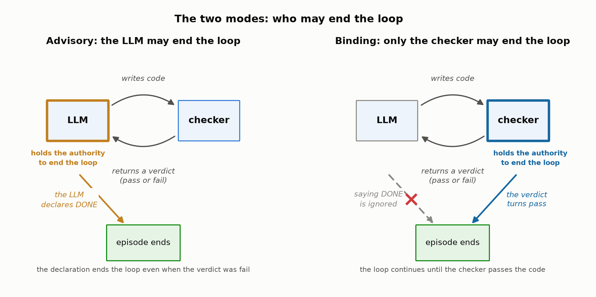
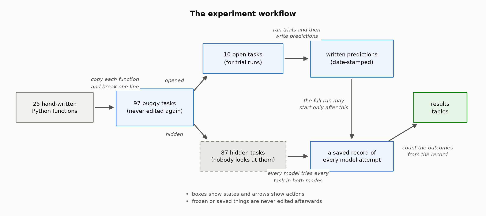

# Binding Feedback Experiment

This repository holds three preregistered experiments on one question: when an LLM agent repairs code in a loop with a checker, does it matter who holds the authority to call the task done. In advisory mode the model may declare the task done and the declaration is believed, while in binding mode the declaration is ignored and the episode ends as solved only when the checker passes the code.

The findings in one paragraph: binding lifted a weak model by 9.2 points and left a strong model unchanged. Across a seven model ladder the gain is a window: it peaks in the middle at +14.9 points, it is zero at the strongest model, and it turns negative at the weakest model. Raising task difficulty by composing two and three bugs roughly doubled the window but never moved its ceiling. The full write up is in `docs/writeup_draft.pdf`.

Everything below is a map: each state of the experiment has a place on disk, and each action has a command that reproduces or verifies it. Task generation and analysis are offline, and only re running the live episodes needs an API key.

## Reproduce it

This block replays the program in the order it actually happened, following the workflow figure. Offline steps carry full commands and expected outputs. The paid steps are marked with a key placeholder: with keys in place the live episodes re run exactly, and without them every offline claim is still checkable because the episode logs are committed.

```bash
git clone https://github.com/kushagrab21/binding-feedback-experiment.git
cd binding-feedback-experiment

# ---------- Experiment 1 ----------

# state: 25 hand written Python functions
python3 phase1_tasks/seeds/validate_seeds.py

# action: copy each function and break one line
# state: 97 buggy tasks (never edited again)
python3 phase1_tasks/generator/generate_tasks.py
python3 phase1_tasks/generator/validate_tasks.py
python3 phase1_tasks/generator/freeze_hash.py
# must print dfc14c26ec267b03c2789752cf7e63c34a06fd3b94dc6cebe14f9f70b62f2017

# action: split into open and hidden
# state: 10 open tasks and 87 hidden tasks
shasum -a 256 phase1_tasks/validation/split.json
# must print 6f69be75d4c1b1ea0348e7b0217ac83e7cfc8c19732a6d6d71e2ec5be9e75015

# the loop machinery: the checker and the two arms, tested offline
(cd phase2_checker && python3 -m unittest test_checker)
(cd phase3_advisory && python3 -m unittest test_harness)
(cd phase4_binding && python3 -m unittest test_harness)

# action: run trials on the open tasks (paid step)
export OPENAI_API_KEY="put a paid OpenAI key here to reproduce the live episodes exactly"
python3 phase5_runs/run_pilot.py

# state: written predictions (date stamped)
# Experiment 1 registered its predictions in EXPERIMENT_LOG.md entry 5.3, before any hidden task ran

# action: run every model on every hidden task in both modes (paid step)
python3 phase5_runs/run_full.py

# action: count the outcomes from the record (offline, needs no key, the logs are committed)
# the analyze scripts print nothing on success, they rewrite the results files in place
python3 phase6_analysis/analyze.py

# ---------- Experiment 2: seven models over the same frozen tasks ----------

# the registration came first: v2_ladder/PREREGISTRATION.md, locked as git tag v2-prereg
# the five OpenRouter models need this key, the two anchors use the OpenAI key above
export OPENROUTER_API_KEY="put a paid OpenRouter key here to reproduce the live episodes exactly"
python3 v2_ladder/runs/run_pilot.py     # paid: trial runs on the open tasks
python3 v2_ladder/runs/run_full.py      # paid: 1218 episodes

# count the outcomes (offline, silent on success)
python3 v2_ladder/analysis/analyze_v2.py

# ---------- Experiment 3: two and three bugs composed per task ----------

# state: the composed tiers, built and pinned offline from Experiment 1 bugs
python3 v3_window/generator/compose_tasks.py
python3 v3_window/generator/validate_k_tasks.py
python3 v3_window/generator/freeze_hash_k.py --tier 1
# must print FREEZE_HASH_K1 sha256 0fd7cc51ecc24e3f6a959b064ce64ac26f29ed113c639f214eb416d48bd2c23b
python3 v3_window/generator/freeze_hash_k.py --tier 2
# must print FREEZE_HASH_K2 sha256 0ac8644e83d3d5c21a17bccc6e32ac0d815168cfd211cabc5268e8f87f4a1a40

# the dev calibration ran next and was disclosed inside the registration,
# then the registration was locked as git tag v3-prereg
python3 v3_window/calibration/run_calibration.py   # paid: the disclosed dev glimpse
python3 v3_window/runs/run_full_v3.py              # paid: 1296 episodes

# count the outcomes (offline, silent on success)
python3 v3_window/analysis/analyze_v3.py

# after the offline steps above nothing committed has changed: regeneration is byte identical
git diff --stat
# must be empty

# ---------- the figures ----------

(cd writeup_figures && python3 verify_data.py)
# must print discrepancies: 0
# the figure data is checked above, the drawings themselves can be redrawn too,
# though the PNG bytes may differ slightly across matplotlib versions
(cd writeup_figures && python3 plot_all.py && python3 plot_diagrams.py)
git checkout -- writeup_figures/figures
# restores the committed figure files if the redraw differed
```

Six commands above are paid. Everything else runs offline, and the whole live program cost under one US dollar.

## Start here

1. Read this README.
2. Read the three write ups: `phase7_writeup/post.md`, then `v2_ladder/writeup/post_v2.md`, then `v3_window/writeup/post_v3.md`.
3. Check the numbers: `phase6_analysis/results.md`, `v2_ladder/analysis/results.md`, `v3_window/analysis/results.md`.

`EXPERIMENT_LOG.md` is the append only ledger of every step and every deviation: it is a reference for looking things up, not reading material. When the text mentions a deviation code such as D18 or V3-D1, this is where to find it.

## The two modes



The loop machinery lives in three files, and each one has an offline test that needs no API key.

| part | where | test |
|---|---|---|
| the checker | `phase2_checker/checker.py` | `cd phase2_checker && python3 -m unittest test_checker` |
| the advisory arm | `phase3_advisory/harness.py` | `cd phase3_advisory && python3 -m unittest test_harness` |
| the binding arm | `phase4_binding/harness.py` | `cd phase4_binding && python3 -m unittest test_harness` |

The two arms import the same presentation builder, the same verdict renderer, and the same checker, so the feedback text is byte identical across arms. They differ only in the three binding rules described in the write up.

## The workflow



Boxes are states and arrows are actions: the tables below give the place and the command for every box and arrow in this figure. The figure shows Experiment 1, and Experiments 2 and 3 reuse its frozen states through their own shorter maps further down.

## Experiment 1 map

States.

| state in the figure | what it is | where | pinned or checked by |
|---|---|---|---|
| 25 hand written Python functions | the seed functions with their test suites | `phase1_tasks/seeds/` | `python3 phase1_tasks/seeds/validate_seeds.py` |
| 97 buggy tasks (never edited again) | one injected bug per task, each task holds `buggy.py`, `reference.py`, `tests.py`, `meta.json` | `phase1_tasks/tasks/` | `python3 phase1_tasks/generator/freeze_hash.py` must print `dfc14c26ec267b03c2789752cf7e63c34a06fd3b94dc6cebe14f9f70b62f2017` |
| 10 open tasks and 87 hidden tasks | the dev and test split | `phase1_tasks/validation/split.json` | sha256 of the file is `6f69be75d4c1b1ea0348e7b0217ac83e7cfc8c19732a6d6d71e2ec5be9e75015` |
| written predictions (date stamped) | Experiment 1 registered its predictions inside the ledger, not in a separate file | `EXPERIMENT_LOG.md` entry 5.3 | the entry precedes every test episode in the log |
| a saved record of every model attempt | one JSONL file per cell plus a manifest per cell | `phase5_runs/logs/` and `phase5_runs/manifests/` | committed and never edited |
| results tables | the success table, the McNemar counts, and the breakdowns | `phase6_analysis/results.md` and `results.json` | regenerate with the analysis command below |

Actions.

| action in the figure | command | needs a key |
|---|---|---|
| copy each function and break one line | `python3 phase1_tasks/generator/generate_tasks.py` then `python3 phase1_tasks/generator/validate_tasks.py` | no |
| split into open and hidden | `python3 phase1_tasks/generator/split_dev_test.py` | no |
| run trials on the open tasks | `python3 phase5_runs/run_pilot.py` | yes |
| run every model on every hidden task in both modes | `python3 phase5_runs/run_full.py` | yes |
| count the outcomes from the record | `python3 phase6_analysis/analyze.py` | no |

The generate command rewrites the 97 tasks byte identically. The analyze command reads only committed files and writes only inside `phase6_analysis/`, and two runs of it produce byte identical output.

## Experiment 2 map

Experiment 2 runs seven models over the same frozen tasks, and nothing from Experiment 1 changes.

| state or action | where or command |
|---|---|
| the registration, locked before any episode | `v2_ladder/PREREGISTRATION.md`, git tag `v2-prereg` |
| the model transport for five providers | `v2_ladder/adapter/client.py` with `keys.py`, `smokes.py`, `validate_schema.py` |
| the saved record, one folder per model and mode | `v2_ladder/runs/logs/full/` with manifests in `v2_ladder/runs/manifests/` |
| the run commands | `v2_ladder/runs/run_pilot.py`, `run_full.py`, and `run_one_cell.py` for the two recovered cells |
| count the outcomes | `python3 v2_ladder/analysis/analyze_v2.py` |
| results tables | `v2_ladder/analysis/results.md` and `results.json` |
| the write up | `v2_ladder/writeup/post_v2.md` |

## Experiment 3 map

Experiment 3 composes two and three Experiment 1 bugs onto single tasks, and the models and the harness do not change.

| state or action | where or command |
|---|---|
| the composed tiers, 2 bugs and 3 bugs | `v3_window/tasks/k1/` and `v3_window/tasks/k2/` |
| how the tiers were built and pinned | `v3_window/generator/compose_tasks.py`, `validate_k_tasks.py`, `split_k.py`, `freeze_hash_k.py` |
| the disclosed dev calibration | `v3_window/calibration/` with its own logs and `manifest.json` |
| the registration, locked before any test episode | `v3_window/PREREGISTRATION.md`, git tag `v3-prereg` |
| the saved record | `v3_window/runs/logs/full/` with manifests in `v3_window/runs/manifests/` |
| the run commands | `v3_window/runs/run_full_v3.py` and `run_one_cell_full.py` |
| count the outcomes | `python3 v3_window/analysis/analyze_v3.py` |
| results tables | `v3_window/analysis/results.md` and `results.json` |
| the write up | `v3_window/writeup/post_v3.md` |

## The figures of the write up

The folder `writeup_figures/` holds the data and the code behind every figure in the write up. The datasets in `writeup_figures/data/` are small CSV files distilled from the three results files, and the script `verify_data.py` recomputes every CSV value from those results files, exiting nonzero on any mismatch. The plotting scripts read only the CSV files, so the chain from episode logs to results tables to figure data is checkable end to end.

```bash
cd writeup_figures
python3 verify_data.py     # every value must match the results files
python3 plot_all.py        # figures 1 to 4
python3 plot_diagrams.py   # figures 5 to 7
```

## Limitations

The write up carries the full list, and the short version follows. The tasks are synthetic single bug mutations and their compositions, and the effect exists only when the specification is stripped from the presented code. The seed functions are common utilities the models have likely seen in training, which inflates absolute success rates but not the advisory versus binding difference. The ceiling claim rests on one model from one provider.

## Provenance

The harness and the analysis code were built with AI assistance under execution verified acceptance gates: every phase advanced only on raw command output audited by the author, and all deviations are recorded in `EXPERIMENT_LOG.md`. The research questions, the registered predictions, and the interpretations are the author's.
